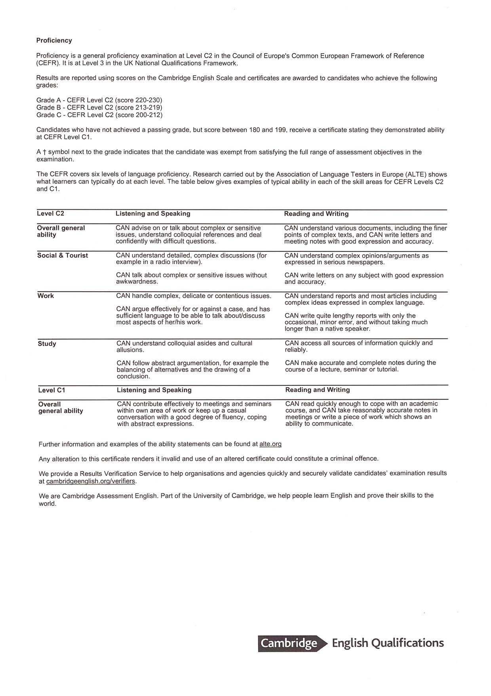

# [rsschool-cv](https://github.com/ustyuzhanina/rsschool-cv)

# **Elena Ustyuzhanina**

## Junior Frontend Developer
 
### **Contact Information**
**[LinkedIn](https://www.linkedin.com/in/elena-ustyuzhanina/)**
**Phone:** +7 960 769 2424 (GMT+7), Whatsapp available
**E-mail:** elena.ustyuzhanina.rus@gmail.com


### **About me**
I like creating something out of nothing (handicraft, photography, art, etc). Probably that is why I had worked for such a long time in procurement divisions at ambitious construction projects.

Project work ensured decent income, but had a significant flaw of obligatory relocation to the actual place of construction, which should had been changed every time along with changes in the work process.

Eventually I have understood, that I do not want my job to define my location and dictate inconvenient and inefficient conditions for development, and started searching for the fields of activities enabling more flexibility and opportunity of remote work.

At the moment I am a junior web developer and have accomplished the course of education in the Practicum by Yandex.

There is certainly a numerous list of things yet to learn and at the same time apply the newly obtained hard skills in real life, but as **LinkedIn** CEO **Jeff Weiner** says, *soft skills are becoming more and more important nowadays*. And these skills are something that I have mastered during the years of work in construction projects procurement.

The majority of my previous places of work implied minimum control from management. Moreover, it was not always possible to get advice on how to act in a particular situation. This nourished my ability of independent case analysis and self-organization.

### **Hard Skills**
- HTML5, CSS3, SCSS
- Javascript (ES6)
- Git, GitHub
- VS Code
- Figma
- Node.js, Express, MongoDB
- Webpack
- OOP, BEM

### **Code Example**
[**Isograms**](https://www.codewars.com/kata/isograms) Kata from CodeWars:

>An isogram is a word that has no repeating letters, consecutive or non-consecutive. Implement a function that determines whether a string that contains only letters is an isogram. Assume the empty string is an isogram. Ignore letter case.

```javascript
function isIsogram(str){
  return str.length === (new Set(str.toLowerCase().split(""))).size;
}
```

### **Web Dev Education**
[RS School](https://rs.school/) **JavaScript/Front-end** Course (in progress).

In 2021 I have completed a **Web Development** Course at the [Practicum by Yandex](https://practicum.yandex.ru/).
During the education process I have done a number of projects, all of which have passed code review by experienced developers. Links to some of the projects are specified below:

#### __*Learning how to learn*__
  - Description: Static one-page website with text and video content with advice on self-eductaion best practices.
  - Technologies: CSS3(animation, transform, flex-box), HTML5
  - [Link to the project's GitHub repository](https://github.com/ustyuzhanina/sprint-02-to-learn-how-to-learn)

#### __*Travel accross Russia*__
  - Description: One-page website with graphic and text inspiring content about beautiful and interesting places in Russia.
  - Technologies: CSS3 (flex-box, grid-layout, adaptive and flexible design in compliance with Figma-based design for 6 screen widths, HTML5(semantic markup), BEM, DevTools, PerfectPixel.
  - [Link to the project's GitHub repository](https://github.com/ustyuzhanina/sprint-4-adaptive-css)

#### __*RegExp*__
  - Description: Demo project for mastering form validation through the use of regular expressions specified in markup patterns in compliance with specific technical task requirements (without JS).
  - Technologies: CSS3, HTML5, BEM, RegExp.
  - [Link to the project's GitHub repository](https://github.com/ustyuzhanina/sprint-10-validation)

#### __*News Explorer*__
  - Diploma project for a full-stack website development with a user registration feature. I have connected the website to a 3rd-party news-aggregator API and to a self-developed API for users registration and saving news in a personal account area. The website can be found on GH Pages and on Yandex.Cloud hosting facility (I have started the server and obtained SSL certificates) at [https://news4u.xyz/](https://news4u.xyz/)

  - Links to GitHub: [Backend](https://github.com/ustyuzhanina/news-explorer-api), [Frontend](https://github.com/ustyuzhanina/news-explorer-frontend)


### **Languages**
- Russian (native)
- English (C2) - Cambridge English Level 3 Certificate in ESOL International (Proficiency) 



